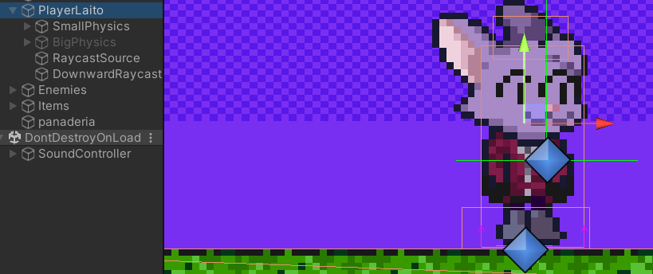
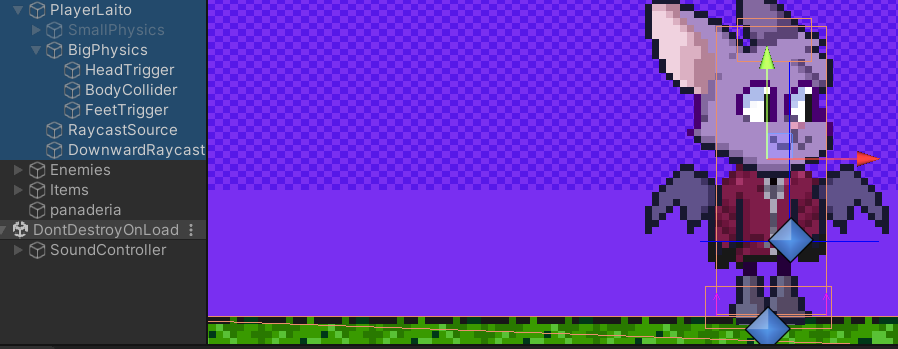
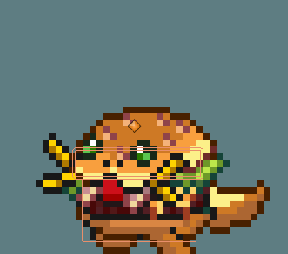
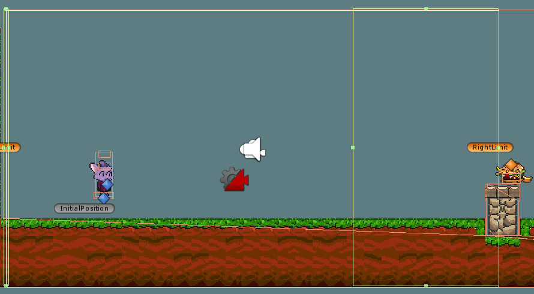

# PEC2 - Light's Cookie Quest

## ¿Cómo Jugar?

Llega al final del nivel para buscar el codiciado Pan, muevete con las flechas direccionales o las teclas WASD y la barra espaciadora para el salto (a mas tiempo oprimida, mayor el salto).

## Estructura Lógica del Proyecto

Para el control de la escena del juego plataforma, se ha hecho una aproximación tratando de mantener las responsabilidades entre
componentes lo más separadas posibles, mientras que se mantiene la forma de interactuar entre dichos componentes. Los más relevantes son:

- PlayerController: Todos los elementos y flujos para el control del personaje dentro del espacio de juego, desde el control de su movimiento lateral como el de sus saltos. Aqui tambien se incluye el control de sus hitboxes, manejo de raycasts, eventos de colisiones y triggers, y animaciones asociadas.
El personaje tendrá 2 conjuntos de Colliders (uno cuando es pequeña y otro cuando es grande), asi como 3 raycasts para la detección de colisión con enemigos y 1 hacia abajo para ayudar a la detección con el suelo cuando sea requerido (el caso puntual para los bloques dado que pueden haber colisiones desde abajo tambien con estos). 
El personaje perderá powerup o morirá al contacto con enemigos que sean detectado por los raycasts. Morirá inmediatamente si cae al vacío, usando un colider invisble denominado Deadzone (No se verá esto por los limites establecidos para la cámara)

- GameManager: Encargado del manejo de las reglas internas del juego, manejo de conteo de Galletas, Puntuación, Tiempo Restante y Vidas, así como ejecutar las transiciones tanto cuando se pierde como cuando se gana. Se define como un Singleton para que los diferentes elementos del juego interactuen con este. Tambien reiniciará la posición del jugador cada que muera por colisionar con enemigos o caer en el vacío.

- EnemyController: Para definir el comportamiento del enemigo, velocidad, animaciones de movimiento y muerte, deteccion de muros y otros elementos que le permitiran moverse en el nivel. 

- Cinemachine: Utilizando el Cinemachine2D provisto por Unity (https://unity.com/unity/features/editor/art-and-design/cinemachine), se logra definir un comportamiento de camara de seguimiento del personaje más controlable, además de confinar el movimiento para así permitir que la cámara solo se mueva en el eje X. Adicionalmente, permite añadir colliders que permitan servir de límite para evitar retroceder en el nivel, el LeftLimit, (simulando este aspecto del Mario Bros. de NES) asi como un area de trigger que hará que los enemigos solo empiecen a moverse al ser tocados por este, el RightLimit (es decir, solo se moveran cuando son captados por la cámara).

-Collectable: Define el comportamiento de los objetos que puede coleccionar el jugador, segun su tipo hará ciertas cosas e incluso tendrán un tiempo de expiración. Actualmente los unicos objetos soportados son Galletas Flotantes, Galletas de Bloque (las que salen de los bloques sorpresa) y los PowerUps para hacer al personaje más grande.

- BlockBehavior: Utilizado para darle comportamiento a los bloques creados a traves de la herramienta de Tilemap de Unity. Por cada tipo de bloque se le dará un flujo de acciones determinada, dependiendo del estado actual del personaje también:
-- Bloques destruibles: Solo destruibles cuando tenemos PowerUp
-- Bloques Sorpresa: Sueltan Galletas de Bloque o PowerUps (Usando Instantiate)
-- Bloques usados: el estado posterior a los bloques sorpresa una vez han soltado todo

- Tambien mencionar que se ha utilizado un RuleTile para la generación del suelo y las tuberias y un Tilemap diferente para los bloques y poder dejar el del terreno estático y el de los bloques alterables por el script de BlockBehavior.

- SoundManager: Utilizado para la reprodución de música de fondo y efectos de sonido, también accesible a través del resto de componentes.

## Estructura de Escenas

1. Pantalla Principal 
2. Nivel 1 - 1
3. Pantalla de Desenlace.
4. Pantalla de Créditos.

## Video en Linea

[Video disponible en Youtube en este enlace](https://www.youtube.com/watch?v=sTWPOa2mF5g)

## Demo en Linea

[Demo disponible en Itch.io en este enlace](https://mutisantos.itch.io/lights-cookie-quest)

## Créditos

Banda Sonora
- Dungeon 7 : RPG Maker VX Ace Runtime Package.
- Tenefo: freesound.org/people/taier/
- Too Bad: Mario Sunshine- Midi Remix
- Battle Victory: Power Bomberman
- Computer Feeling: freesound.org/people/LittleRobotSoundFactory/

Efectos de Sonido
- RPG Maker VX Ace Runtime Package.
- https://kronbits.itch.io/freesfx

Personajes:
- Light: @Raitochan3
- Pan: @p4n.n

